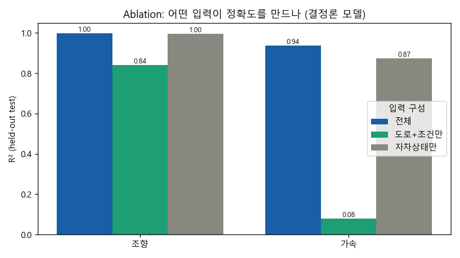
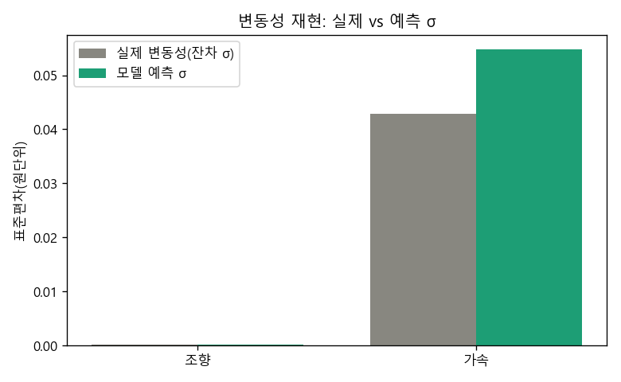
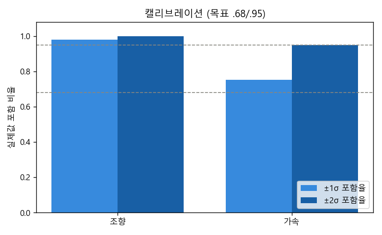
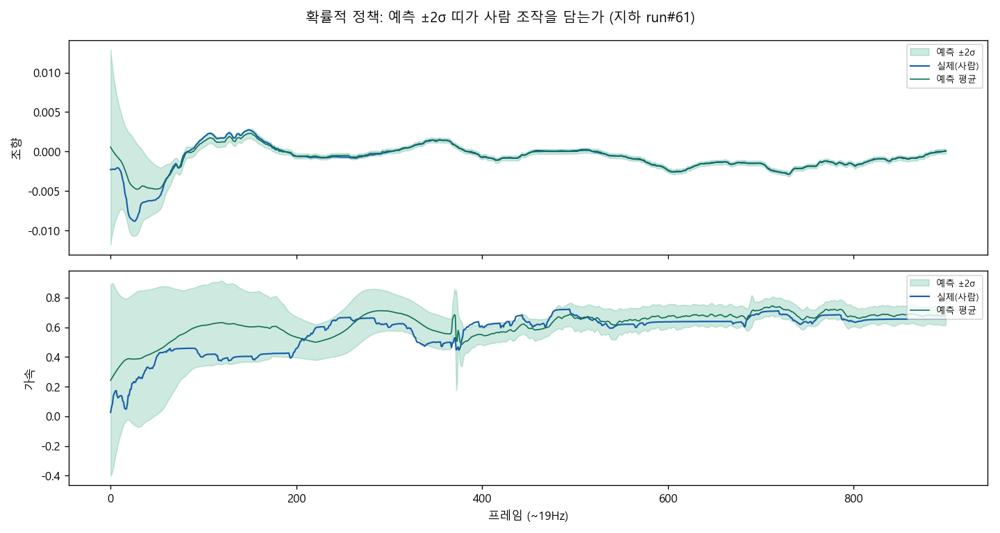
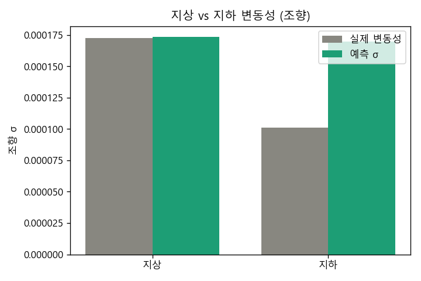

# 2024 지하고속도로 — 확률적·조건부 정책 PoC + Ablation

> 데이터: 32명 × {지상, 지하} 장거리 주행, held-out 피실험자 평가.

## 1. ★Ablation — 정확도의 출처 (가장 중요)

결정론 모델 R²를 입력 구성별로 비교: '전체' vs '도로+조건만' vs '자차상태만'.

| 행동 | 전체 | 도로+조건만 | 자차상태만 |
|---|---|---|---|
| 조향 | 0.998 | 0.842 | 0.996 |
| 가속 | 0.939 | 0.080 | 0.874 |

**해석:**
- `자차상태만`이 `전체`에 근접하면 → 높은 정확도는 *기하 판단*이 아니라 **자차상태 연속성(물리·관성)**에서 온 것. (steering이 특히 그럼)
- `도로+조건만`의 R²가 *순수 기하→행태* 신호의 크기. 낮더라도 이게 **'도로를 보고 반응하는 가상 운전자'**의 실제 설명력.
- 즉 연구적으로 의미있는 부분은 `도로+조건만` 모델이며, 전체모델의 높은 수치는 상당부분 *거품*임을 정량적으로 보여줌.

## 2. 변동성 재현 (확률적 정책, 전체입력)

| 행동 | 실제 변동성 σ | 예측 σ | ±1σ 포함 | ±2σ 포함 |
|---|---|---|---|---|
| 조향 | 0.0001 | 0.0002 | 0.98 | 1.00 |
| 가속 | 0.0429 | 0.0548 | 0.75 | 0.95 |

예측 σ가 실제와 가깝고 포함율이 .68/.95에 근접 → '평균'이 아니라 '분포'를 학습.

## 3. 그림

**Ablation: 정확도의 출처**

**변동성: 실제 vs 예측 σ**

**캘리브레이션**

**예측 ±2σ 띠 vs 실제 (시계열)**

**지상 vs 지하 변동성**

## 4. 한계

- 열린 루프 평가. SDLP 완전 재현·새 기하 평가엔 시뮬레이터 닫힌 루프 필요.
- brake는 장거리 고속주행이라 거의 0 → 제외.
- '자차상태'는 제어기엔 필요하지만 도로설계 효과 해석 시 분리 필요(→ ablation).
