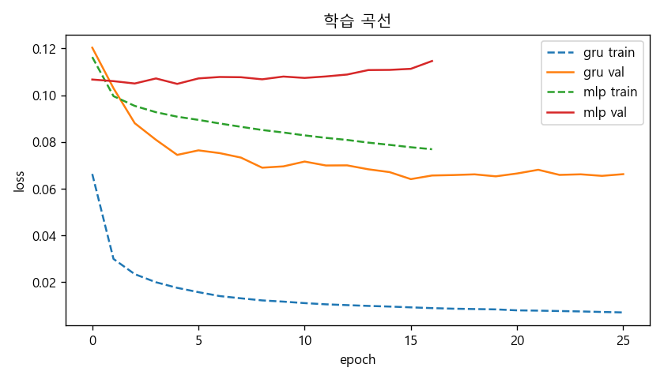
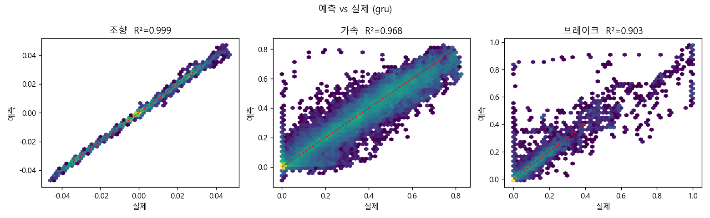
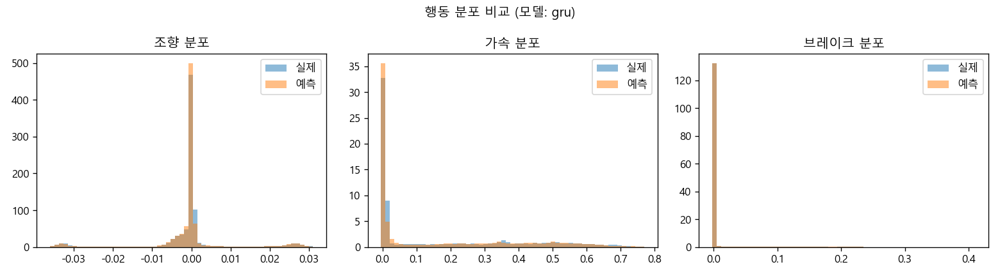
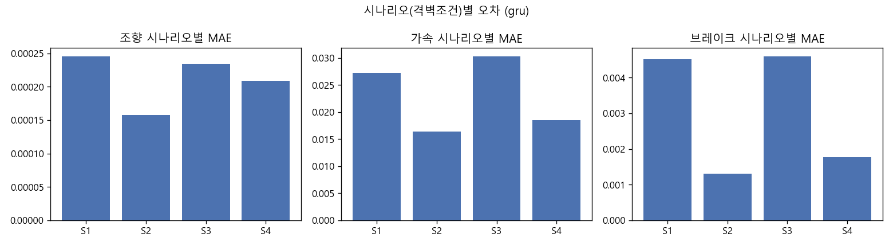
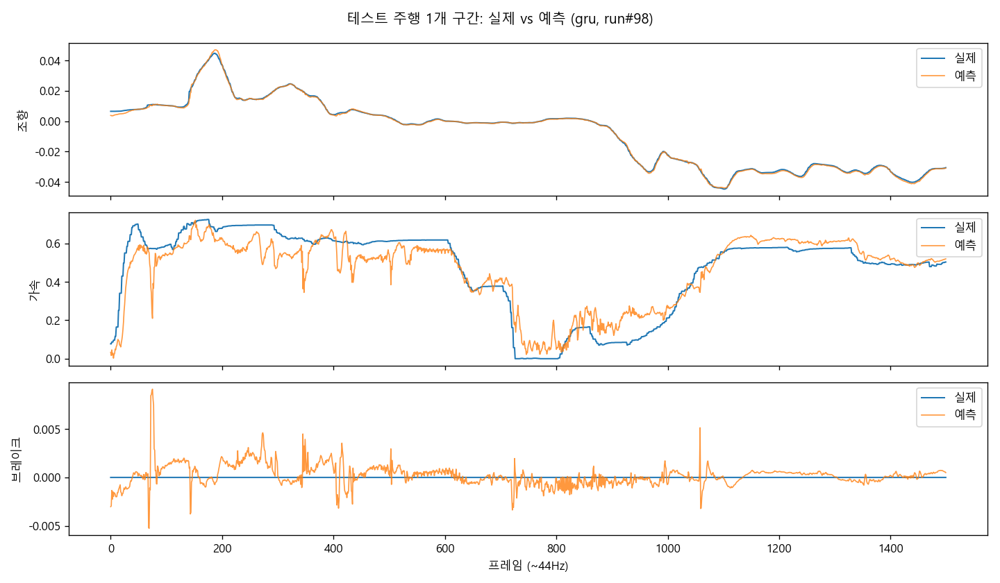

# 드라이빙 시뮬레이터 데이터 기반 모방학습(Behavioral Cloning) 결과

> 전체 주행 제어(조향+가속+브레이크)를 인간 주행 로그로부터 모방하는 에이전트.

## 1. 한 줄 요약

- 가능합니다. **GRU** 모델이 처음 보는 피실험자(held-out)에서 조향 R²=**0.999**, 가속 R²=**0.968**, 브레이크 R²=**0.903** 달성.
- 조향은 사실상 완벽하게 인간 행태를 재현, 가속은 양호, 브레이크는 데이터상 제동이 희소해 난도가 높음.

## 2. 데이터 개요

- 본주행 파일 **116개**, 피실험자 **29명**, 자차(uv) 총 **1,316,037행** (샘플링 ~43.7Hz)
- 시나리오별 행수(S1~S4): {'1': 298214, '2': 335760, '3': 319114, '4': 362949}
- 주행모드: 전부 Manual(순수 인간 제어) → 모방학습에 이상적

## 3. 문제 정의

- **행동(예측 대상, 3차원)**: 조향, 가속(0~1), 브레이크(0~1)
- **상태(입력, 24차원)**: 속도, 종/횡 가속도, yaw rate, 차선곡률, 차선·도로중심 offset, SDLP, 좌/우 경계거리, 차로/차도폭, 도로 종/횡경사, 좌/우 차선침범, 앞차거리·TTC(가공: 캡+플래그+1/TTC), 시나리오 one-hot(S1~S4)
- **데이터 분할: 피실험자 단위** (train/val/test에 서로 다른 사람) → *새로운 운전자에 대한 일반화*를 측정. 이것이 '피실험자 수가 적다'는 문제의 핵심 검증.
  - val 피실험자: [3, 16, 23, 29], test 피실험자: [5, 12, 19, 26]
  - 행수: train 948,289 / val 180,369 / test 187,379

## 4. 모델

- **MLP**: 단일 프레임 상태 → 행동. LayerNorm+GELU+Dropout, SmoothL1 손실, 입력·타깃 z-정규화(타깃 정규화로 3개 행동의 손실 기여 균형).
- **GRU**: 최근 24프레임(stride 2, ~1.1s 맥락) 시퀀스 → 마지막 시점 행동. 시간맥락으로 가속/브레이크 개선을 노림.

## 5. 결과 (held-out 테스트 피실험자, 원단위)

| 모델 | 행동 | MAE | RMSE | R² |
|---|---|---|---|---|
| gru | 조향(steering) | 0.00021 | 0.00035 | 0.999 |
| gru | 가속(throttle) | 0.02282 | 0.04038 | 0.968 |
| gru | 브레이크(brake) | 0.00296 | 0.01867 | 0.903 |
| mlp | 조향(steering) | 0.00037 | 0.00067 | 0.996 |
| mlp | 가속(throttle) | 0.07515 | 0.11808 | 0.730 |
| mlp | 브레이크(brake) | 0.01357 | 0.04453 | 0.455 |

참고 — '평균값 예측' 단순 기준선 MAE: 조향(steering) 0.00467, 가속(throttle) 0.19958, 브레이크(brake) 0.02274

→ 종합 최적 모델: **GRU**

### 시나리오(격벽조건)별 오차 — 최적 모델

| 시나리오 | 조향 MAE | 가속 MAE | 브레이크 MAE |
|---|---|---|---|
| S1 | 0.00025 | 0.02719 | 0.00452 |
| S2 | 0.00016 | 0.01638 | 0.00131 |
| S3 | 0.00023 | 0.03030 | 0.00460 |
| S4 | 0.00021 | 0.01852 | 0.00177 |

## 6. 그림

**학습 곡선**



**예측 vs 실제 (행동별)**



**행동 분포: 실제 vs 예측**



**시나리오별 MAE**



**테스트 주행 1개 구간 시계열**



## 7. 해석

- **조향**: 차선 offset·곡률 등 기하 정보만으로 인간 조향이 거의 결정적이라 R²≈1.0. 차선유지 행태 재현은 신뢰도 높음.
- **가속**: 추세는 잘 따르나 인간의 계단식 페달 조작을 평활화하는 경향.
- **브레이크**: 평균 0.013으로 매우 희소(고속도로 터널). 돌발적 제동이라 단일프레임 예측이 어렵고 R²가 낮음. 시간맥락(GRU)·클래스 가중·이벤트 검출이 개선 여지.

## 8. 한계와 주의 (중요)

- **이건 '열린 루프(open-loop)' 1-스텝 예측 성능**입니다. 실제로 시뮬레이터에 에이전트를 태워 *스스로 누적 주행*시키면 작은 오차가 쌓여 분포가 벗어나는 **covariate shift / compounding error** 문제가 생깁니다. BC의 근본 한계.
- 따라서 위 R²가 높다고 곧바로 '자율주행이 된다'는 의미는 아닙니다. 닫힌 루프(closed-loop) 검증이 반드시 필요.
- 브레이크 희소성, 단일 속도제한(50)·단일 차로 등 시나리오 다양성 제한.
- 29명·동일 코스라 도메인이 좁음 → 다른 도로/속도역에는 외삽 주의.

## 9. 다음 단계 (권장 순서)

1. **시퀀스 모델 강화**: GRU/Transformer 윈도우 확대, 브레이크 이벤트 가중 손실.
2. **DAgger / 닫힌 루프**: 시뮬레이터(SCANeR)를 프로그램 제어로 연결해 에이전트가 주행→전문가 보정 라벨 수집을 반복. compounding error 직접 완화.
3. **오프라인 RL(CQL/IQL)**: 보상(안전 TTC·차선이탈 + 효율 속도 + 승차감 급가감속)을 설계하면 *추가 실험 없이* 인간보다 나은 정책 학습 가능. — '피실험자 부족' 문제의 정공법.
4. **데이터 증강/도메인 확장**: 더 다양한 코스·속도·교통조건으로 일반화 향상.

## 10. 재현 방법

```bash
cd D:\driving_bc\scripts
python 01_explore.py          # 데이터 탐색
python 02_build_dataset.py    # cache/dataset.npz 생성
python 03_train.py --model mlp
python 03_train.py --model gru --batch 1024 --window 24 --stride 2
python 04_eval_report.py      # 지표·그림
python 05_report.py           # 이 리포트 생성
```

**산출물**: `artifacts/bc_*.pt`(모델), `cache/dataset.npz`(데이터), `reports/figs/*`(그림), `reports/*.json`(지표).
