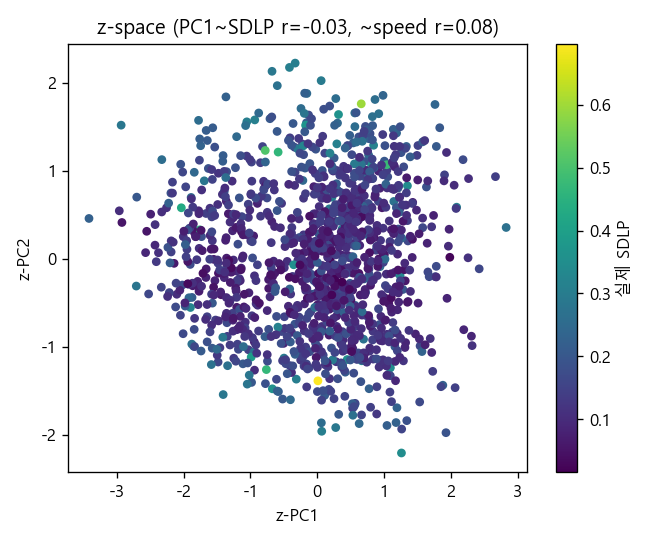
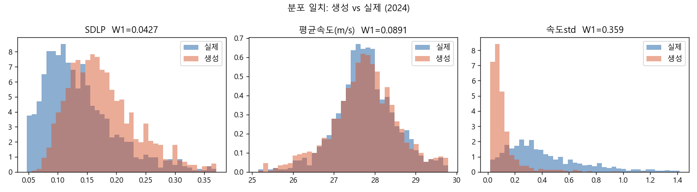
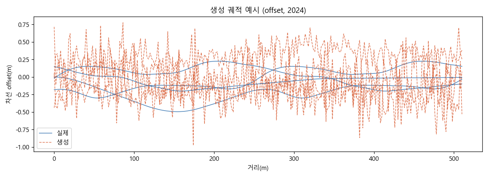
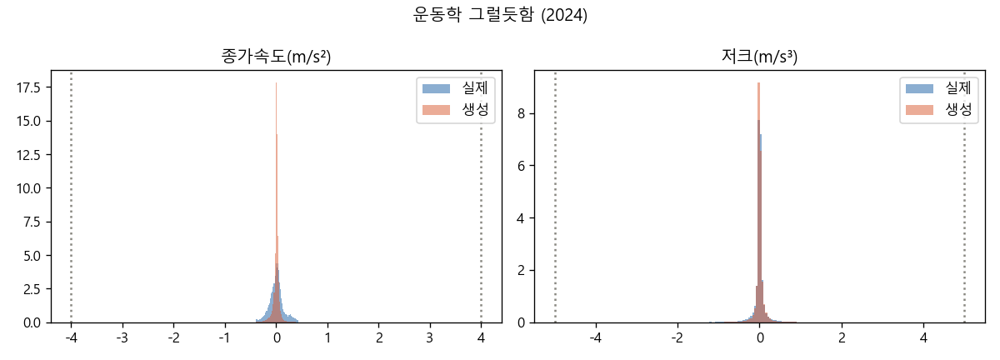
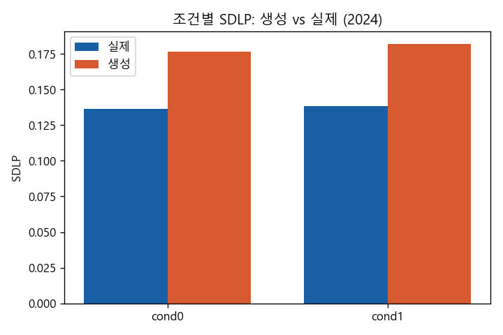
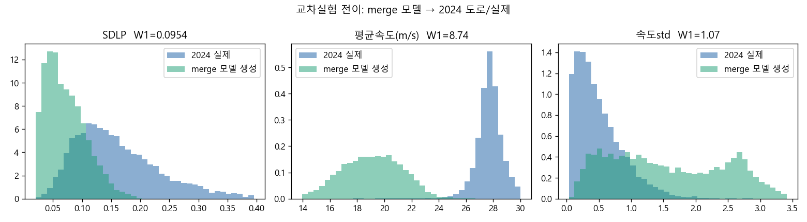

# 운전행태 생성모델(CVAE) — 검증 리포트 (2024)

> distance 재인덱싱 궤적에 대한 조건부 CVAE. prior z~N(0,I)에서 합성 주행 생성, held-out 피실험자와 *분포* 비교.

## 1. within-experiment 검증

- 테스트 윈도: 1293 | geo차원 5 | z차원 16
- posterior collapse 점검: 학습 KL>0 이어야 z가 쓰임 (metrics_cvae_2024.json 참고)

### 분포 일치 (생성 vs 실제, 작을수록 좋음)

| 지표 | Wasserstein | KS | 실제평균 | 생성평균 |
|---|---|---|---|---|
| SDLP | 0.04266 | 0.327 | 0.137 | 0.179 |
| 평균속도 | 0.08915 | 0.040 | 27.8 | 27.7 |
| 속도std | 0.3589 | 0.680 | 0.47 | 0.111 |

### z-space (스타일 분리)
- z-PC1 ↔ SDLP 상관 **-0.03**, ↔ 평균속도 **0.08** (|상관|이 크면 z가 의미있는 스타일축을 잡음)

### 운동학 그럴듯함 (임계 초과 비율)
- |가속|>4 m/s²: 생성 0.000 / 실제 0.000
- |저크|>5 m/s³: 생성 0.005 / 실제 0.000

### 조건효과 재현 (SDLP)
| cond | 실제 SDLP | 생성 SDLP | n |
|---|---|---|---|
| 0 | 0.1365 | 0.1767 | 650 |
| 1 | 0.1385 | 0.1818 | 643 |

### 그림

**z-space (스타일)**

**분포 일치**

**생성 궤적 예시**

**운동학**

**조건별 SDLP**

## 한계 (정직하게)

- 생성 다양성은 **학습 데이터 manifold에 묶임** — 데이터에 없던 운전스타일은 생성 못 함.
- 입력이 **god's-eye 도로기하** — 조명·시야·심리 등 *지각 요인은 모델 밖*.
- 열린 분포비교 기준. (교차실험 전이는 15_cross_validate 참고)

---

## 2. 교차실험 전이 검증

**merge 학습 모델 → 2024 도로 위 실제 사람 주행**과 비교 (검증 윈도 8281).

| 지표 | Cross W1 | Cross KS | (참고) Within W1 | 전이 gap |
|---|---|---|---|---|
| SDLP | 0.0954 | 0.594 | 0.1555 | -0.06007 |
| 평균속도 | 8.744 | 0.985 | 0.2491 | 8.495 |
| 속도std | 1.07 | 0.562 | 0.6137 | 0.4563 |

**혼동요인 명시**: 실험 간 차이엔 도로기하뿐 아니라 *렌더링·속도역·실험셋업*이 섞여 있어, 전이 gap이 순수 'geometry→behavior 전이실패'인지 *미모델링 도메인 시프트*인지 분리 불가. gap 자체를 **전이 한계**라는 발견으로 해석한다.
