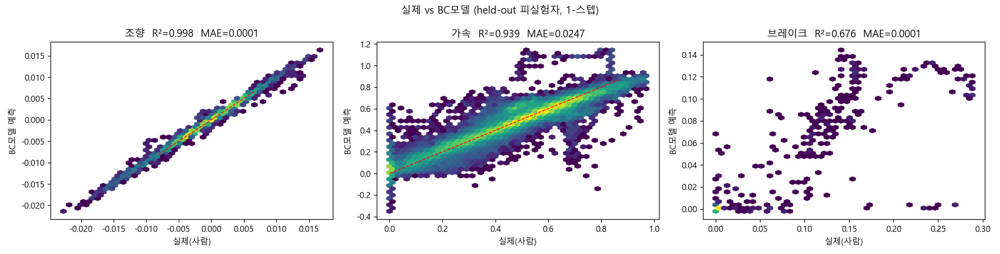
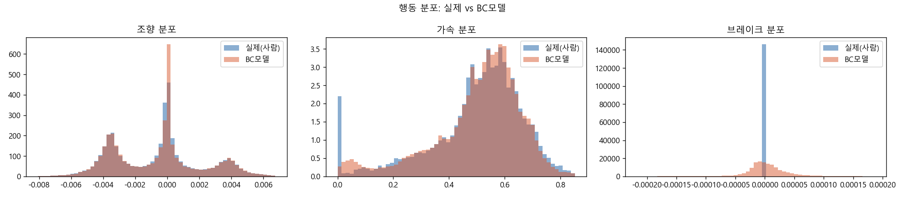
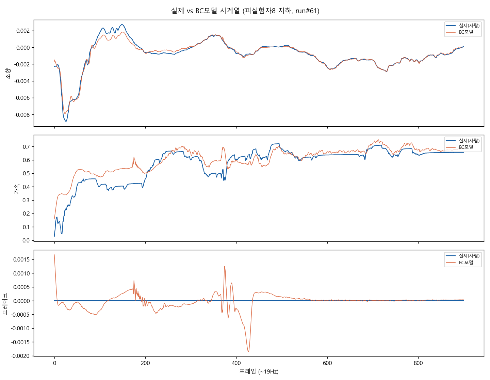
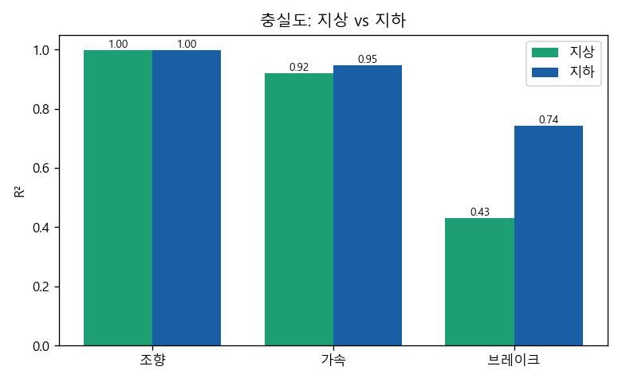
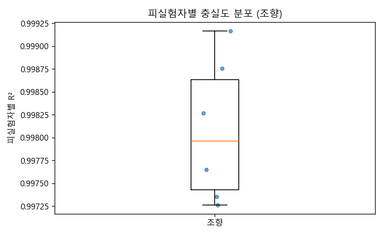

# 실제 사람 vs BC모델 — 충실도 비교 (2024 지하고속도로)

> held-out 피실험자(학습 미사용)에서 **결정론 BC(평균선) 모델**이 사람 주행을 얼마나 재현하는가. 열린 루프(1-스텝) 기준.

## 전체 정확도

| 행동 | R² | MAE |
|---|---|---|
| 조향 | 0.998 | 0.0001 |
| 가속 | 0.939 | 0.0247 |
| 브레이크 | 0.676 | 0.0001 |

## 지상 vs 지하 충실도 (R²)
| 행동 | 지상 | 지하 |
|---|---|---|
| 조향 | 0.998 | 0.998 |
| 가속 | 0.920 | 0.946 |
| 브레이크 | 0.430 | 0.741 |

- 피실험자별 조향 R² 중앙값 0.998 (범위 0.997~0.999) → 사람별 편차.

## 그림

**예측 vs 실제 산점도**

**행동 분포 일치**

**시계열 오버레이**

**지상 vs 지하 충실도**

**피실험자별 충실도**

## 주의

- **열린 루프 1-스텝 충실도**다 (사람의 실제 상태를 매 순간 주고 다음 조작 예측). 자율 누적주행(닫힌 루프)과는 다름.
- 조향 R²가 높은 데엔 *자차상태 연속성* 기여가 큼(ablation 참조) — 순수 도로반응 충실도는 그보다 낮음.