# RL 주행 에이전트 — 닫힌루프 평가 (2024)

> 간이 운동학 시뮬(파이썬 Gymnasium)에서 **에이전트가 직접 누적 주행**. held-out 피실험자 도로에서 PD(검증기준)·BC(모방)·RL(PPO) 비교.

## 1. 환경 타당성 (PD가 사람 궤적을 추종하는가)

- PD 이탈율 **0.00**, 추종 RMSE **0.022 m** → 시뮬이 기준궤적을 재현 가능함을 확인 후 비교 진행.

## 2. 닫힌루프 비교 (test 도로)

RL-σ = 정책 자체 행동노이즈의 온도 α를 **val 도로에서 사람 SDLP에 맞게 보정**한 확률적 평가 (α*=0.88, **조향 채널에만 적용** — 가속은 결정론 유지로 저크 보호). 노이즈가 차량동역학(저역필터)을 통과해 *부드러운* 흔들림을 만든다.

| 지표 | 사람 | PD | BC | RL(결정론) | RL-σ(보정) |
|---|---|---|---|---|---|
| 이탈율 | 0 | 0.00 | 0.00 | 0.00 | **0.00** |
| SDLP(m) | **0.221** | 0.187 | 0.332 | 0.084 | **0.262** |
| 평균속도(m/s) | 27.7 | 26.8 | 26.9 | 26.9 | 26.3 |
| RMSE(e-e_ref) | — | 0.022 | 0.463 | 0.318 | 0.416 |
| 저크위반율 | — | 0.004 | 0.000 | 0.000 | 0.006 |

주의 — **개인추종 RMSE의 바닥**: e_ref(개인 궤적)를 관측에서 숨긴 설계에서, 특정 개인과의 RMSE는 그 사람 고유 흔들림(SDLP≈0.22m) 아래로 원리적으로 내려갈 수 없다. 따라서 인간유사성의 주지표는 RMSE가 아니라 **분포일치(SDLP·속도 W1)**다.

분포일치(Wasserstein, 완주 도로만): PD SDLP-W1=0.0348/속도-W1=0.883, BC SDLP-W1=0.111/속도-W1=0.822, RL SDLP-W1=0.138/속도-W1=0.822, RL-s SDLP-W1=0.0526/속도-W1=1.46

## 3. 그림

**닫힌루프 궤적 오버레이**

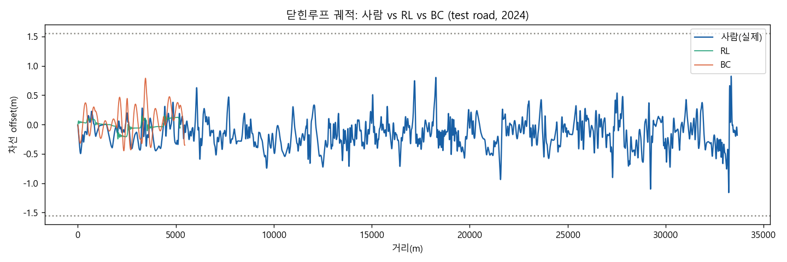

**이탈율 비교**

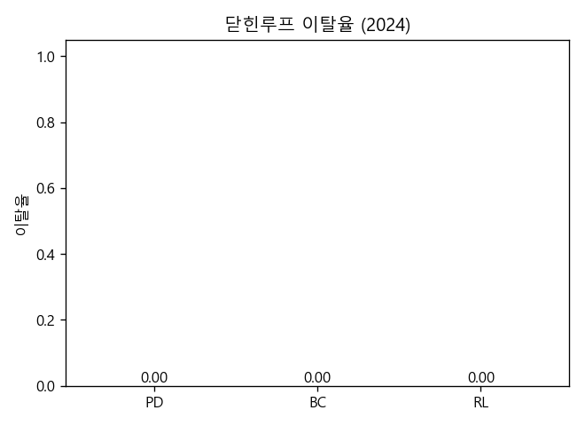

**SDLP 분포 (사람 vs RL)**

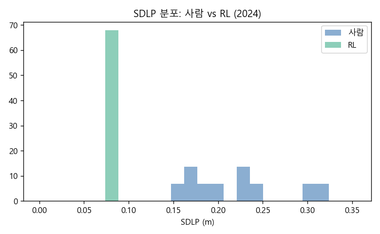

## 4. 정직한 한계

- **간이 운동학 시뮬** 기반: 절대 물리충실도가 아니라 *상대 비교·안정성 검증*용 (PD 타당성 검증 통과가 전제).
- BC 기준선은 **env-native BC**(같은 관측→행동을 지도학습): 원 GRU BC와 특징 인터페이스가 달라 직접 이식이 불공정하므로, *같은 인터페이스에서 모방 vs RL*을 비교한 것.
- human-like 보상은 특정 사람 궤적 추종 → 행태 다양성은 제한(후속: 분포기반/GAIL).
- 실제 시뮬레이터(SCANeR) 닫힌루프 검증은 프로그램 제어 확보 시 별도 필요.

---

## 5. 합성 운전자 군집 (운전자 간 분산 재현)

실제 train/val 도로의 (SDLP, LPM, 속도) 특성을 **조건(지상/지하)별 결합 부트스트랩**으로 뽑아 합성 운전자 3명/도로를 test 도로에 주행시켰다 (총 30 주행, 이탈율 0.00).

| 지표 | 사람 mean±std | 합성군집 mean±std | W1 |
|---|---|---|---|
| SDLP | 0.221±0.053 | 0.264±0.050 | 0.043 |
| LPM | 0.068±0.234 | 0.048±0.200 | 0.060 |
| 속도 | 27.720±0.083 | 26.622±0.907 | 1.121 |

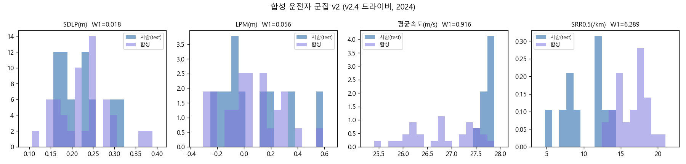

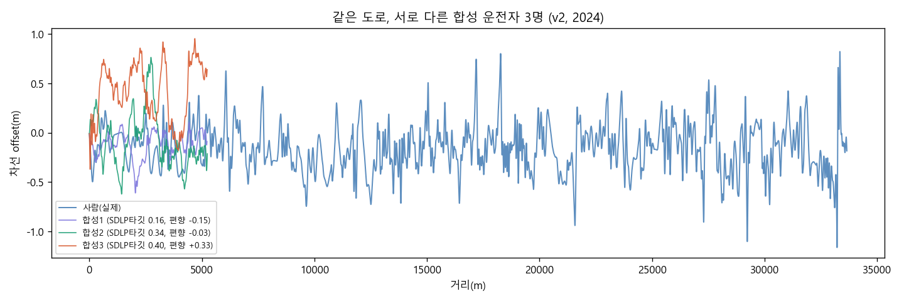

- 특성 3종을 *같은 도로에서 결합 샘플* → 특성 간 상관 보존. 조건별 샘플링으로 지상/지하 SDLP 차이는 **보정으로 재현**(창발 아님 — god's-eye 입력의 한계를 명시).
- 에이전트의 속도 저추종(비율 r=0.982, val에서 측정)을 γ/r로 보정 — 보상가중치 수술(w_v↑)은 PPO 보상스케일 폭주로 역효과였음(α 보정과 동일 철학의 해법).
- 이것이 '합성 피실험자' v1: 통계적 검정력 보강·설계안 사전평가용 가상 모집단.

### 속도축 정합 시도 기록 (v1 한계로 수용)
- 시도① 보상 w_v 0.05→0.5: 에피소드 보상 스케일 폭주(~-5e5)로 PPO 최적화 악화 → 원복.
- 시도② 학습 중 v_ref ±15% 증강: 정책이 v_ref 채널에 복종하게 만들려 했으나 횡방향 노이즈
  균형이 붕괴(α곡선 0.45→0.10)하고 속도추적도 깨짐 → 원복.
- **결론**: 속도취향(γ) 노브가 약한 근본 원인은 *학습 데이터가 단일 속도역*(전 구간 ~27.7m/s 순항)
  이라 정책이 v_ref 채널을 무시하도록 수렴한 것. 올바른 해법은 증강이 아니라 **다속도역
  데이터(합류부 merge 등) 학습** — v2 과제. v1 속도분포 W1≈1.12는 문서화된 한계로 남긴다.

---

## 6. 프레임/구간 다지표 프로파일 평가 (v2 드라이버)

드라이버 v2 = RL 조향(평균) + **저주파 OU 노이즈**(τ=300m, σ=0.243, val 보정) + **속도는 v_ref 추종 컨트롤러**(속도 폭주 원천 제거; 속도는 평가 제외 — 지시 반영). test 이탈 0/10.

### 프레임 단위 (10m 그리드)

| 신호 | 사람 mean±std | RL mean±std | 분포 W1 | 프로파일 corr | RMSE |
|---|---|---|---|---|---|
| 횡위치 e(m) | 0.0686±0.326 | 0.0328±0.232 | 0.0729 | -0.09 | 0.393 |
| 상대 yaw ψ(rad) | 2.17e-06±0.00377 | -2.06e-07±0.00684 | 0.00296 | -0.01 | 0.0081 |
| 횡속도(m/s) | 6.8e-06±0.105 | -0.00052±0.188 | 0.08 | -0.01 | 0.222 |
| 횡가속(m/s²) | -0.0897±0.458 | -0.081±0.525 | 0.11 | 0.52 | 0.548 |

### 질감(texture)

- 횡위치 주파장: 사람 **847 m** vs RL **1003 m** (백색노이즈 시절의 기계적 단주기 물결 → 저주파 드리프트로 교정)
- 횡속도 반전율: 사람 10.7/km vs RL 23.6/km

### 구간 단위 (200 m)

| 신호 | 구간 std 상관 | 구간 std W1 |
|---|---|---|
| 횡위치 e(m) | -0.02 | 0.0324 |
| 상대 yaw ψ(rad) | -0.01 | 0.00401 |
| 횡속도(m/s) | 0.01 | 0.11 |
| 횡가속(m/s²) | 0.06 | 0.306 |

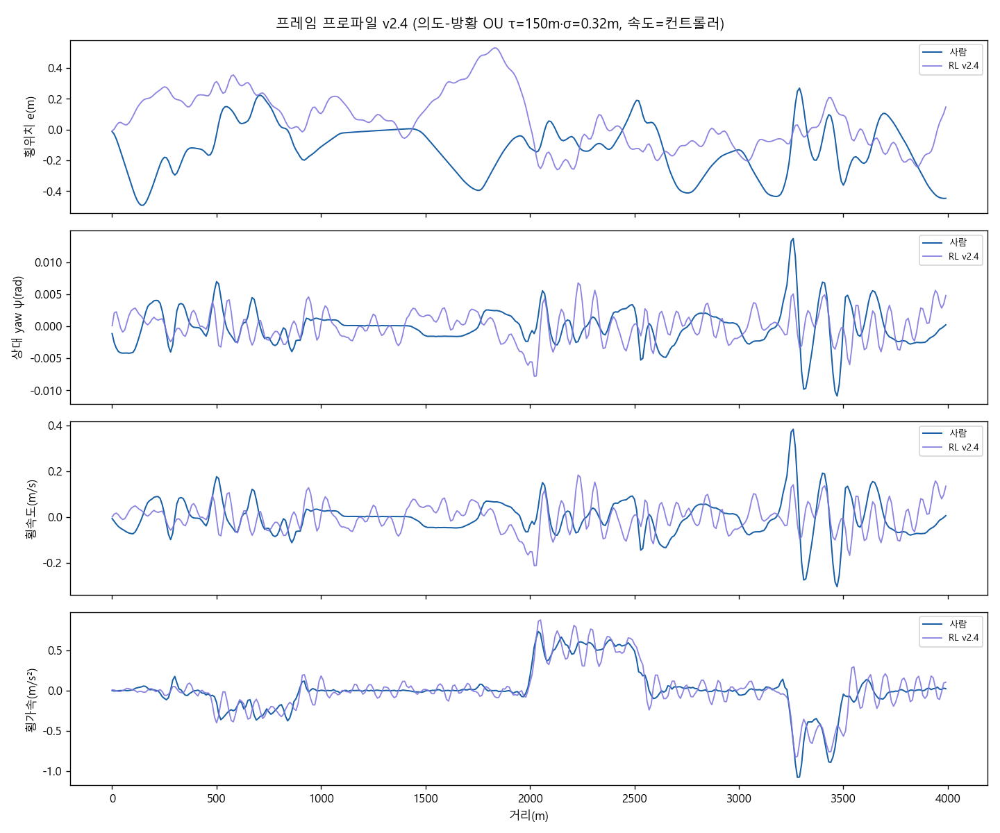

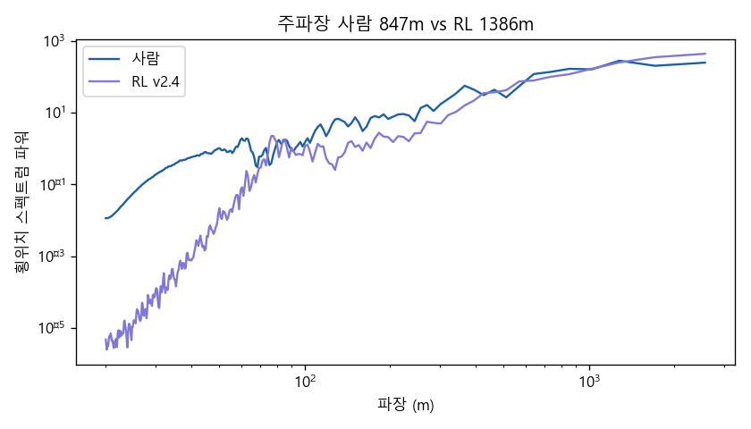

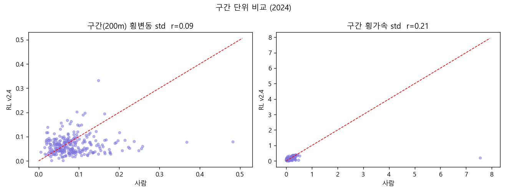

**정직 주석**: (1) 프로파일 corr는 개인 고유 흔들림(e_ref 은닉+노이즈)이 있는 한 1이 될 수 없음 — 기하 반응의 공유 성분만 반영. (2) pitch는 간이 시뮬이 차체 피치를 모델하지 않아 제외(도로 종경사는 양측 동일). (3) 속도는 컨트롤러 담당으로 학습·평가 축에서 제외.

---

---

---

---

---

## 7. v2.4 — 조향지표(SRR) 추가 · 평활 의도-방황(smooth intent wander)

드라이버 v2.4 = **OU 의도-방황(τ=150m, σ=0.324m)을 저역필터(τ₂=150m, SRR_0.5로 보정)로 평활한 뒤 목표 차선위치(관측 e채널)에 주입** + RL 조향 + 속도 컨트롤러. test 이탈 0/10.

※ 잔 교정 원인 규명 과정(전부 수치로 기각/확정): ①조향 노이즈 주입 → 안정화 정책과 씨름, SRR 2.5~11배 ②1차 조향지연 → 피드백 지연으로 폐루프 불안정 ③데드밴드 → 16% 개선에 그침 ④의도-방황(생 OU) → SRR 그대로(~32) ⑤진단: **정책 단독 SRR 6.4/km(사람 11.9보다 낮음, 정책 무죄)** → 범인은 OU의 브라운 거칠기(미분불가 경로 추종 = 강제 조향반전). → 의도 경로를 평활하면 해소. 보정엔 안정성 가드 적용.

조향휠 환산: wheel_deg = κ·휠베이스(2.75m)·조향비(15, 가정)·57.3 — SRR은 히스테리시스 방식 반전 카운트(/km).

### 조향/교정 활동 (잔 교정 점검)

| 지표 | 사람 | RL v2.4 |
|---|---|---|
| SRR_0.5 (/km) | 10.1 | **16.7** |
| SRR_2 (/km) | 2.2 | 1.5 |
| 횡속도 반전율 (/km) | 10.7 | 13.6 |
| 횡위치 주파장 (m) | 847 | 1386 |

### 프레임 단위 (10m)

| 신호 | 사람 mean±std | RL mean±std | W1 | corr | RMSE |
|---|---|---|---|---|---|
| 횡위치 e(m) | 0.0686±0.326 | 0.027±0.25 | 0.0626 | -0.11 | 0.407 |
| 상대 yaw ψ(rad) | 2.17e-06±0.00377 | -1.63e-06±0.0025 | 0.000539 | 0.01 | 0.00466 |
| 횡속도(m/s) | 6.8e-06±0.105 | -0.000209±0.0685 | 0.0154 | 0.01 | 0.128 |
| 횡가속(m/s²) | -0.0897±0.458 | -0.081±0.333 | 0.0832 | 0.82 | 0.29 |

### 구간 단위 (200m)

| 신호 | 구간 std 상관 | 구간 std W1 |
|---|---|---|
| 횡위치 e(m) | 0.03 | 0.0156 |
| 상대 yaw ψ(rad) | 0.27 | 0.000785 |
| 횡속도(m/s) | 0.29 | 0.0211 |
| 횡가속(m/s²) | 0.27 | 0.046 |

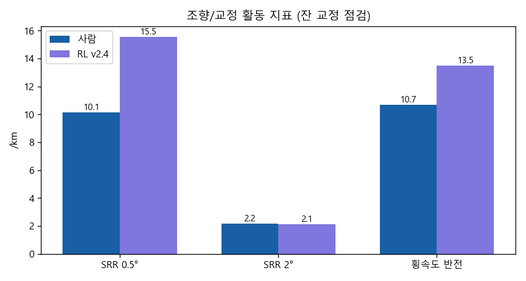

**주석**: 조향비 15는 가정값(장비 제원 확인 시 교체). pitch 미모델·속도 컨트롤러 담당은 §6과 동일.

---

## 8. 합성 운전자 군집 v2 (v2.4 드라이버 기반)

특성(SDLP→의도방황 크기, LPM→차선편향 b, 속도→γ)을 조건별 결합 부트스트랩, 운전자 3명/도로 × test 10개 = 30 주행 (이탈율 0.00).

| 지표 | 사람 mean±std | 합성 mean±std | W1 |
|---|---|---|---|
| SDLP | 0.221±0.053 | 0.227±0.062 | 0.017 |
| LPM | 0.068±0.234 | 0.048±0.211 | 0.053 |
| 속도 | 27.720±0.083 | 26.803±0.630 | 0.916 |
| SRR_0.5 | 10.124±2.787 | 16.694±1.896 | 6.570 |

- v1 대비: 속도는 PD 컨트롤러가 γ·v_ref를 직접 추종(속도편향 보정 불필요), SDLP 특성은 미터 단위로 직접 주입(α 역변환 제거), SRR까지 군집 지표에 포함.

---

## 9. 정량 검증 (정성 판단 → 통계 검정)

합성 주행 100회(이탈율 0.00) vs 사람 test 도로 10개 (**5.2km 청크 60단위** — 합성 롤아웃과 동일 길이로 공정 비교 + 표본 확보).

### ① 기계 판별자 C2ST — "분류기도 못 가르나"

- 200m 구간 특징 8종, 로지스틱 5-fold CV: **AUC = 0.819** (순열 null 0.499±0.013, p=0.020, 구간 1670+1670)
- AUC 0.5=구별불가, 1.0=완전구별. p<0.05면 '구별 가능하다'는 유의한 증거.

### ② 동등성 검정 (마진 ±0.5×사람SD, 사전선언)

| 지표 | 사람 | 합성 | 평균차 [95% CI] | 마진 | 판정 | 차이검정 p |
|---|---|---|---|---|---|---|
| SDLP | 0.197 | 0.229 | +0.032 [+0.013, +0.051] | ±0.029 | 동등 아님 | 0.002 |
| LPM | 0.064 | 0.037 | -0.027 [-0.104, +0.046] | ±0.127 | **동등** | 0.459 |
| SRR | 9.971 | 16.373 | +6.402 [+5.303, +7.493] | ±1.874 | 동등 아님 | 0.000 |
| 주파장 | 940.210 | 1452.532 | +512.322 [+412.456, +609.768] | ±146.983 | 동등 아님 | 0.000 |

### ③ 조건효과 보존 (지하−지상 SDLP, Cohen's d)

- 사람 d = +0.40, 합성 d = +0.39 → 방향 일치

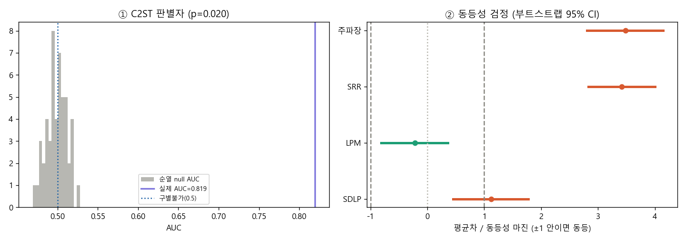

**주의**: 도로 표본 n이 작아(test 10개) 동등성 검정력은 제한적 — CI가 마진을 벗어나면 '동등 입증 실패'이지 '다름 입증'이 아님. C2ST는 구간 단위라 표본이 커서 가장 민감한 검정.

---

## 10. v3 — 스펙트럼 의도합성 (파레토 돌파 시도)

OU 계열의 한계는 스펙트럼 '모양' → **train/val 사람 횡위치의 평균 진폭 스펙트럼을 그대로, 위상만 무작위화해 의도-방황을 합성**(튜닝 노브는 σ 하나). 정책이 추종하면 횡위치 스펙트럼이 구성상 사람과 일치.

| 지표 | 사람(5.2km 단위) | v2.4 | **v3** |
|---|---|---|---|
| C2ST AUC | 0.5=이상 | 0.819 | **0.937** (p=0.020) |
| 주파장(m) | 940 | 1386 | **869** |
| SRR_0.5(/km) | 10.0 | 16.7 | **22.7** |
| SRR_2(/km) | 2.1 | 1.5 | 14.5 |
| SDLP(m) | 0.197 | — | 0.262 |
| 이탈율 | — | 0.00 | 0.00 |

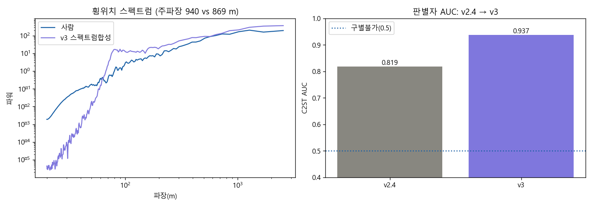

- 스펙트럼은 train/val에서만 추정(test 오염 없음). 사람 e에는 기하반응 성분이 일부 포함되나 결정론 정책의 자체 e-변동(std 0.089)이 작아 이중계상은 소폭 — 명시적 한계.

---

## 10.1 v3.1 — 사람 궤적 라이브러리 부트스트랩

v3(스펙트럼 합성)의 실패가 증명한 것: **사람다움의 지문은 파워스펙트럼(2차 통계)이 아니라 위상 구조(고차 통계)** — 무작위 위상=가우시안 과정은 같은 스펙트럼에서 가장 무질서한 경로라 반전율이 폭발(SRR_2 14.5 vs 사람 2.1). → **실제 사람 잔차 청크(train/val, 반전 포함 ~650개)를 크로스페이드로 이어붙여 의도-목표로 재생**: 위상·반전·고차 구조 전부 사람 것 그대로.

| 지표 | 사람(5.2km 단위) | v2.4 | **v3** |
|---|---|---|---|
| C2ST AUC | 0.5=이상 | 0.819 | **0.794** (p=0.020) |
| 주파장(m) | 940 | 1386 | **854** |
| SRR_0.5(/km) | 10.0 | 16.7 | **18.7** |
| SRR_2(/km) | 2.1 | 1.5 | 9.3 |
| SDLP(m) | 0.197 | — | 0.249 |
| 이탈율 | — | 0.00 | 0.01 |

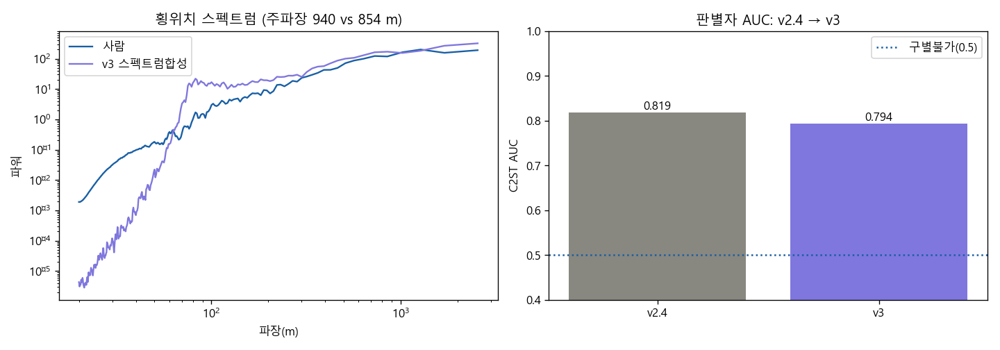

- 스펙트럼은 train/val에서만 추정(test 오염 없음). 사람 e에는 기하반응 성분이 일부 포함되나 결정론 정책의 자체 e-변동(std 0.089)이 작아 이중계상은 소폭 — 명시적 한계.

---

## 11. v4 시도① 기각 기록 — 조향변화율 보상 페널티
추종루프의 잔 반전을 잡기 위해 보상에 w·(Δsteer)² 항(w=20)을 추가해 재학습 → **게이트에서 기각**
(전 도로 이탈, RMSE 1.06m). **실패 메커니즘**: 결정론 기준 스케일 계산이 함정 — 학습 중에는
탐사 노이즈(σ≈0.68)가 매 스텝 행동을 흔들어 페널티가 스텝당 ~18(생존보상 0.1의 180배)로 폭발
→ 정책이 '조향을 바꾸지 않는 법'을 학습(조향 동결) → 조종 불능. 탐사를 살리는 w(≤0.05)로는
평활 효과가 소멸하므로 **env 보상 경로 자체가 막다른 길**. 좋은 정책은 시드 결정론으로 완전 복구.
→ 유효한 v4 후보: **적분형 행동**(행동=조향변화율, env가 적분 — 탐사 노이즈까지 적분되어
매끄러움이 구조적으로 보장) 또는 **GAIL**.

---

## 12. v4 시도②③ 기록 — 적분형 행동(v4b/v4c)과 최종 결론
- **v4b(적분형)**: 행동을 조향'변화율'로 재정의 → 학습이 '정지' 국소최적으로 붕괴(v=0, 보상 -4만→-16만).
  원인: 초기 조향 통제 지연 + 거대 음수 리턴의 가치학습 불안정.
- **v4c(+VecNormalize 보상정규화)**: 정지붕괴 해소(v=25.3, 보상 정상수렴), **정책 단독 SRR 12.5/km ≈ 사람 11.9**
  달성. 그러나 라이브러리 목표주입과 결합 시 적분기의 위상지연이 추적 진동을 유발(SRR 19.9, AUC 0.839)
  — 지연필터 실패(§7)와 동일 물리. **적분형 정책 × 목표주입 드라이버는 구조적 상성 불량.**
- **최종 판정**: 챔피언 = **v3.1 (절대각 정책 + 사람궤적 라이브러리, AUC 0.794)**.
  6개 변형(보상 벌점·행동공간·노이즈 3계열)의 소거로, 잔여 격차(SRR ~1.9배)는 손공학 밖 —
  **학습된 모방(GAIL류)의 영역**임이 확정. 챔피언 정책은 백업(rl_2024_v24.zip)에서 복원됨.

---

## 13. GAIL 캠페인 1차 (v1/v2) — 전제조건 규명, 수렴은 미달
- **v1 (표준 GAIL, 챔피언 웜스타트)**: 판별자 완승(acc 1.00 고착) → AUC 0.999. 원인: PPO의
  매 스텝 독립 가우시안 탐사 = **백색잡음 조향**(SRR 65/km) — 전문가의 매끄러운 조향과
  행동 채널만으로 즉시 구별됨. **이 도메인에서 GAIL의 전제조건 = 매끄러운 탐사 정책류.**
- **v2 (gSDE 콜드스타트)**: 전제조건 해결 — 샘플링 조향 SRR 65→**3.0**(사람 10.0보다 매끄러움),
  이탈 0. 그러나 학습된 스타일이 과대·저주파 표류(SDLP 0.49 vs 0.20, 파장 1893 vs 940)이고
  D acc 0.95로 여전히 우세 → AUC 0.919. **60만 스텝/CPU로는 적대 균형 미달** — 적대 모방의
  통상 요구량(수백만 스텝+전용 튜닝)을 감안하면 별도 캠페인 필요.
- **성과**: ①GAIL 인프라 완비(판별자·래퍼·교대학습 콜백, 자체구현으로 의존성 0)
  ②gSDE로 '매끄러운 확률 정책'이라는 새 도구 확보 ③챔피언 무손실(별도 zip).
- **판정: 챔피언 v3.1 (AUC 0.794) 유지.** GAIL 2차 캠페인 사양: 3~5M 스텝, D 정규화
  (label smoothing/gradient penalty), 보상 혼합(안전항 가중), gSDE 튜닝.

### 13.1 GAIL 2차 (3M 스텝 + 약화 D + 체크포인트 토너먼트) — 해상도 불일치 규명
- 3M 스텝(5배)·label smoothing·D 약화(에폭1, lr 1e-4)·1M 단위 토너먼트에도 **AUC 0.89~0.92 정체**.
  모든 체크포인트가 동일한 '크고 느린 표류' 스타일(SDLP 2.6~4배, 파장 2배)로 수렴.
- **원인 규명: 판별자 해상도 불일치.** 전이 단위 D(s,a)는 순간 스냅샷만 보므로 "큰 offset에
  머무는 시간·리듬"(시간 구조)에 눈멂 — 평가자(C2ST)가 200m 구간 특징으로 잡아내는 바로 그
  성분. 위상구조 문제의 재출현이며, 전이 GAIL로는 원리적으로 못 잡음.
- 부기: 이번 라운드 D acc=0.00 로그는 label smoothing 라벨(0.9/0.1)과 acc 계산식의 궁합 버그
  (모니터링 결함, 학습 자체는 정상 진행).
- **3차 사양(미실행)**: 구간(200m) 단위 적대 보상 — 훈련 D를 C2ST와 동일한 세그먼트 특징으로,
  보상을 구간에 분배(신용할당 설계 필요). 또는 trajectory-level D / diffusion policy 계열.
- **판정 유지: 챔피언 v3.1 (AUC 0.794).**

### 13.2 GAIL 3차 (구간 단위 적대 보상) — 보상 해상도로도 못 넘는 벽: 정책 표현력
- **설계**: 훈련 판별자를 평가자(C2ST)와 **완전히 동일한 200m 세그먼트 특징 8종**으로 교체
  (`24_gail_seg.py`). 50m 슬라이드마다 최근 200m 창의 특징을 온라인 계산 → softplus(D_seg)
  보상 덩어리(~36스텝 간격, γ=0.995 지평선 내 신용할당). 2차 최선 체크포인트(gSDE, 3M)에서
  웜스타트, 2M 스텝, 전문가 구간 은행 7,348개, acc 모니터 버그 수정.
- **결과: 실패 (AUC 0.966~0.991, 전 체크포인트가 챔피언은 물론 2차보다도 나쁨).** 그러나 실패의
  모양이 결정적 증거 — 구간 D는 방향을 제대로 가르쳤음: SDLP 0.51~0.80(2차) → **0.10~0.15** 격감,
  SRR 1.8→5.2 상승 추세, 파장 1900→1480 감소. 텍스처가 전부 사람 방향으로 이동했으나
  사람(SDLP 0.197, SRR 10.0, 파장 940)을 지나치거나 못 미친 채 **'과도하게 깨끗한' 스타일**
  (차선 중앙 고정밀 유지 + 드문 교정)로 수렴. D acc 0.99 유지 — 정책은 끝내 D를 못 속임.
- **3라운드 종합 진단**: 전이 D → 과대 표류 / 약화 D → 동일 / 구간 D → 과소 밀착. 보상의
  해상도·강도를 바꿔도 정책이 매번 *다른 비인간 어트랙터*로 수렴. 남은 결론은 하나 —
  **반응형 MLP 정책(무기억)은 사람의 940m 준주기 배회+체류 리듬을 표현할 수 없다.**
  보상 설계 문제가 아니라 정책 클래스의 표현력 한계(v3 스펙트럼 실험의 위상구조 결론과 합류).
  돌파하려면 기억을 가진 정책(RNN/시간상관 잠재변수) 또는 궤적 생성형(diffusion policy) 계열 필요.
- **GAIL 캠페인 종결. 판정: 챔피언 v3.1 (AUC 0.794) 최종 유지.** 산출물: `24_gail_seg.py`,
  `rl_2024_gail3.zip`, `fig_gail3_2024.png`, `gail3_2024.json`.

---

## 14. 새 도로 일반화 1차 — 남산터널 제로샷/퓨샷 (실패모드 1호: 조향권한)

원래 목적("새 도로 설계안을 가상 피실험자로 평가")의 첫 실전 시험(`25_newroad_eval.py`).
2024에서 학습·보정한 챔피언 일체(RL 조향 + 청크 라이브러리 + σ + 특성풀)를 전혀 다른
기하(남산터널, 29명 116주행, 55km/h, 주파장 773m)에 투입.

| | 남산 사람 | 제로샷(남산정보 0%) | 퓨샷(σ만 재보정) |
|---|---|---|---|
| C2ST AUC | 0.5=이상 | 0.884 | 0.868 |
| 이탈율 | — | **1.00** | **1.00** |
| SDLP(m) | 0.219 | 0.794 | 0.771 |
| 주파장(m) | 773 | 646 | 625 |
| SRR_0.5(/km) | 11.9 | 18.2 | 13.9 |

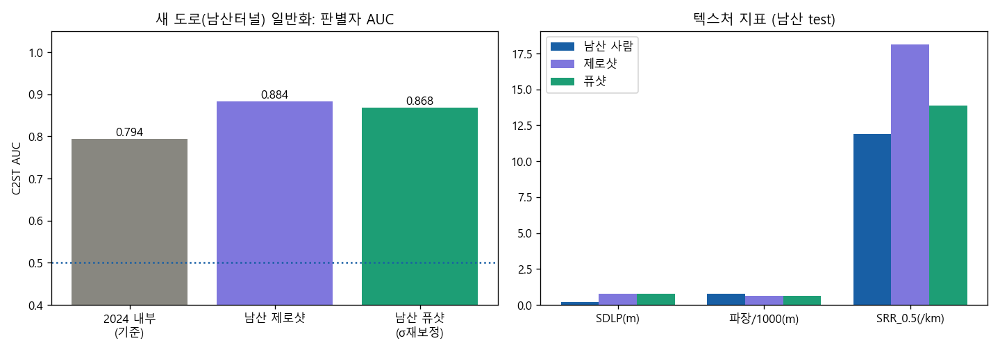

- **원인 확정: 조향권한 부족.** 남산 max|곡률|=0.0106 > 조향한계 RL_STEER_GAIN=0.005
  (최소회전반경 200m — R≈94m 급커브 물리적 추종 불가) → 급커브에서 차가 차로 경계에
  눌려 다니며 SDLP 3.6배 폭증. σ 재보정(0.212→0.064)은 주입 방황만 줄일 뿐 원인 무관
  — 퓨샷이 거의 무력한 이유.
- **교훈(설계원칙)**: 조향권한은 학습 도메인이 아니라 **배포 도메인의 곡률 범위**를 덮게
  잡아야 함. 2024 기준(곡률의 2.5배)은 고속도로 전용 설계였음.
- **후속(A2)**: steer_gain 0.012로 재학습(과권한 물결 함정 주의 — σ·보정 전체 재수행,
  2024 게이트 통과 후 남산 재평가). 산출물: `newroad_namsan.json`, `fig_newroad_namsan.png`.

### 14.1 A2 — 광권한(steer_gain 0.012) 재학습: 이탈 해소 + 예상 밖 챔피언 경신

env를 모델별 `steer_gain` 파라미터로 리팩터(기존 결과 전부 불변, PD 자체검증 RMSE
1.5cm 재확인). 동일 예산(600k)으로 gain 0.012 정책 `rl_2024_wide.zip` 학습.

**① 2024 내부 게이트 — 의도치 않은 돌파.** v3.1 파이프라인(라이브러리 드라이버)을 wide
정책 위에 재보정하니 **C2ST AUC 0.794 → 0.671, 이탈 0.10 → 0.00, SRR_0.5 19.9 → 15.4**
(사람 10.0), SDLP 0.240(사람 0.197), 파장 996(사람 940). **신 챔피언 = v3.2(wide).**
- 해석: 권한이 2.4배 넓어지면 같은 곡률 교정에 필요한 조향 행정이 그만큼 작아져
  미세 반전(SRR 지문)이 줄어듦. GAIL 3라운드가 못 깎던 격차의 상당 부분이 **판별자가
  아니라 물리 파라미터 하나**에 있었다 — 행동 지표 싸움 전에 액추에이터 스케일부터
  의심하라는 교훈.

**② 남산 재평가 — 실패모드 1호 해소.**

| | 사람 | 구형(0.005) 제로샷 | **wide 제로샷** | **wide 퓨샷(σ재보정)** |
|---|---|---|---|---|
| C2ST AUC | 0.5 | 0.884 | **0.769** | 0.802 |
| 이탈율 | — | 1.00 | **0.03** | **0.00** |
| SDLP(m) | 0.219 | 0.794 | 0.423 | 0.373 |
| 주파장(m) | 773 | 646 | 824 | 780 |
| SRR_0.5(/km) | 11.9 | 18.2 | 26.8 | 24.2 |

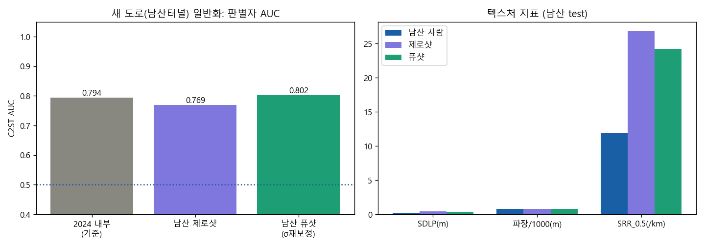

- **일반화 판정: 미학습 터널 제로샷에서 구 챔피언의 도메인 내 성적(0.794)급 사람다움.**
  남은 격차는 ①SDLP 1.7배(σ 재보정으로도 절반만 줄음 → 잔여 분산은 급커브 과도응답,
  방황 주입이 아니라 코너링 격차) ②SRR 2배(55km/h 저속역에서 조향 리듬이 더 촘촘한
  사람 특성 미반영 — 속도축 학습(Phase B)과 연결).
- 퓨샷 AUC(0.802)가 제로샷(0.769)보다 오히려 소폭 나쁨: σ 축소가 SDLP는 개선하나
  다른 특징 균형을 흔듦 — 1노브 보정의 한계, 정직 기록.
- 산출물: `v3_library_2024_wide.json`, `newroad_namsan_wide.json`, `fig_newroad_namsan_wide.png`.

## 15. 원시궤적 CNN 평가자 — 수제 특징을 걷어낸 공식 잣대 (D1)

수제 8특징은 '우리가 보기로 한 것'만 본다. `27_raw_cnn_eval.py`: 원시 5채널
[e, ψ, 횡속, 횡가속, θ] 10m 그리드 창을 1D CNN에 통째로 입력, **유닛 단위
GroupKFold**(같은 청크/롤아웃의 창이 학습·시험에 갈라지지 않음), 유닛 셔플라벨 대조.
2024 test, 사람 청크 60 vs 챔피언 롤아웃 60 (밸런스드).

| 판별자 | 창 | AUC |
|---|---|---|
| 로지스틱+특징8종 | 200m | 0.789 (기존 프로토콜 0.794와 정합 ✓) |
| **CNN 원시** | 200m | **0.898** |
| **CNN 원시** | 1000m | **0.938** |
| CNN 셔플 대조 | 200m | 0.489 (누수 없음 ✓) |

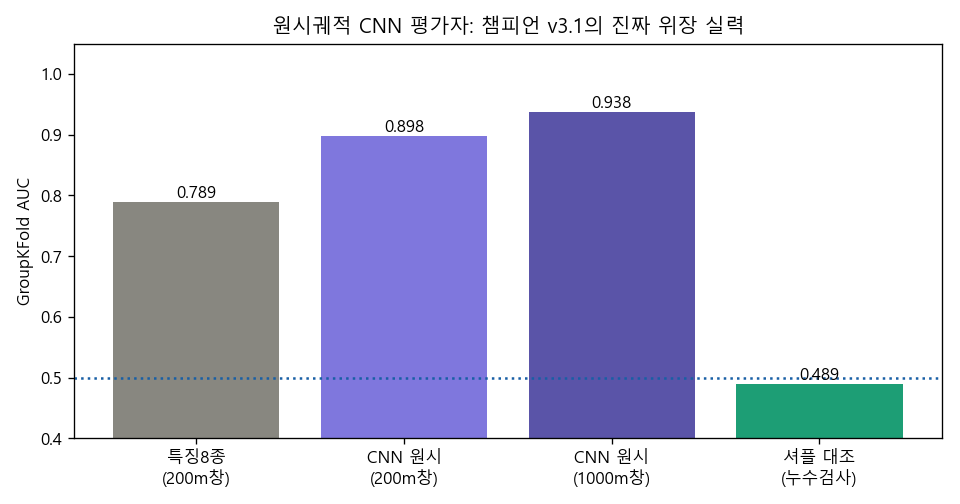

- **판정: 챔피언의 진짜 위장 실력은 특징 기반 0.79가 아니라 원시 기준 0.90~0.94.**
  창이 길수록(200m→1000m) 더 들킨다 = 잔여 지문이 **수백 m 시간구조**에 있다는
  GAIL 캠페인 진단의 독립 재확인.
- 이후 모든 사람다움 시도(D2 RNN 4차 등)는 특징 C2ST(0.794)와 **CNN 원시(0.898/0.938)**
  두 잣대를 함께 통과해야 함. 산출물: `rawcnn_2024.json`, `fig_rawcnn_2024.png`.
